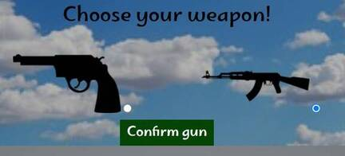

# Battlefield duel  

Battlefield duel is a landing page for a game in which your main task is to win the opponent in a shooting duel. At each turn, you can choose where you want to move and where you want to shoot. An enemy will do the same. Your main goal is to guess where the enemy will move and aim at the place and guess where the enemy will shoot so you can avoid that place. Each time when you or your enemy gets hit his HP will be reduced. First whoever loses all HP will lose.

## Languages Used

* HTML5
* CSS3
* Javascript

## Features

- When you will open this page you will see in the middle of the screen white text "Click hear to start game" when you will click on the text, text will disappear and the game will start.

- In this game, you can choose one of two guns, each with its benefits. A player can see these benefits when he/she hovers over the gun. When the player hovers over a weapon, under the gun will appear text, in this text player will be able to read about the benefits of each weapon.

- If you hit enemy successfully with AK-47 damage is significantly higher than with pistol.

- If you choose a pistol you can shoot at two positions simultaneously. But the damage is smaller than ak-47.

- Under the "choose guns" section on the left side, you can see your health points and on the right side, you will see enemy health points. These points will reduce each time when you will hit the target or you will be hit.

- After each turn on the screen, you will see what enemy you made move and wear you and your enemy he'd shoot. If someone guesses correctly the opponent's moves, the opponent's HP will be reduced and it will be seen on screen how big damage is made. There is a slite chance that you can win a game only with one shot if a headsot is made.

- You can choose where you want to move and wear you want to shoot, if you pick a pistol as a weapon you will be able to shout in two places.

- After each turn in the description section will appear short description regarding the previous turn.

- If someone's HP will drop under 0 game will and there will appear new screen with the text You win on You Lose. After that there will be the text "Click here to start game" when you will click on the text, the text will disappear and a new game will start.

- In this game, sound effects are used:
  - background music
  - shooting sound when a shot is made
  - sound effect when you made a hit
  - sound effect when enemy made a hit
  - sound effect if you win a game
  - sound effect if you lose a game

## Testing

- This page is tested on Desktop using Chrome, Safari, and MS Edge and also tested on tablets and mobile phones.
- On all devices and browsers homepage is working without issues.

## Validator Testing

- HTML
  - No errors were returned when passing through the official W3C validator <a href="https://validator.w3.org/nu/?doc=https%3A%2F%2Fkasparsmazurs.github.io%2Fbattlefield_duel%2F" target="_blank">W3C validator</a>
- CSS
  - No errors were found when passing through the official (Jigsaw) validator <a href="https://jigsaw.w3.org/css-validator/validator?uri=https%3A%2F%2Fkasparsmazurs.github.io%2Fbattlefield_duel%2F&profile=css3svg&usermedium=all&warning=1&vextwarning=&lang=en" target="_blank">(Jigsaw) validator</a>
- Accessibility
  - By using lighthouse in devtools i can confirm that the fonts are easy to read

## Deployment

The site was deployed to GitHub pages. The steps to deploy are as follows:

1. Log in to GitHub and locate the GitHub Repository
2. At the top of the Repository (not top of page), locate the "Settings" Button on the menu.
3. Scroll down the Settings page until you locate the "GitHub Pages" Section.
4. Under "Source", click the dropdown called "None" and select "Master Branch".
5. The page will automatically refresh.
6. Scroll back down through the page to locate the now published site link in the "GitHub Pages" section.

The live link can be found <a href="https://kasparsmazurs.github.io/battlefield_duel/" target="_blank">here</a>

## Credits

### Content

  - The icons in the Header were taken from <a href="https://fontawesome.com/" target="_blank">Font Awesome</a> 
  - The fonts in the homepage were taken from <a href="https://fonts.google.com/" target="_blank">Google Fonts</a>

### Media

  - On this homepage are used royalty-free photos and audio fils from <a href="https://pixabay.com/photos/" target="_blank">Pixabay</a> in Home and Contact me sections
